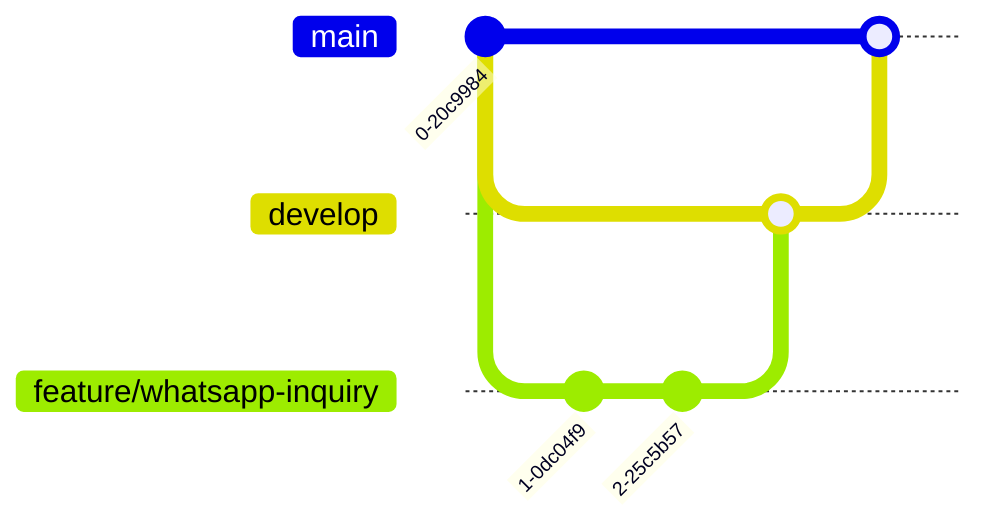

# Git Workflow

---

## Branch Strategy

| Branch | Purpose | Deployed To | Protection |
|--------|---------|-------------|------------|
| `main` | Production | Hostinger | CI must pass before merge; no direct pushes |
| `develop` | Staging / integration | (optional staging env) | CI must pass before merge |
| `feature/*` | New features | None | Branched from `develop`, merged via PR |
| `fix/*` | Bug fixes | None | Branched from `develop`, merged via PR |
| `hotfix/*` | Emergency production fixes | Hostinger (manual) | Branched from `main`, merged back to `main` and `develop` |

---

## Branch Naming Conventions

| Branch Type | Pattern | Example |
|-------------|---------|---------|
| Feature | `feature/short-description` | `feature/whatsapp-inquiry-flow` |
| Fix | `fix/short-description` | `fix/slug-collision` |
| Hotfix | `hotfix/short-description` | `hotfix/critical-auth-bypass` |

Use lowercase kebab-case for branch names. Keep descriptions short (2-5 words).

---

## Workflow

### Feature development



1. Create a `feature/*` branch from `develop`.
2. Make changes, commit frequently with clear messages.
3. Open a pull request to `develop`.
4. CI runs automatically. Fix any failures.
5. Merge to `develop` after approval and green CI.
6. When `develop` is stable, open a PR from `develop` to `main`.
7. CI runs again. After approval, merge to `main`.
8. Hostinger auto-deploys `main` (or deploy manually).

### Bug fixes

Same as feature development but use `fix/*` branches.

### Hotfixes

1. Branch directly from `main`: `hotfix/*`.
2. Fix the issue and push.
3. Open a PR to `main` (skip `develop`).
4. After merge, also merge `main` back into `develop` to keep them in sync.

---

## Commit Messages

Use clear, descriptive commit messages:

```
type(scope): short description

[optional body]
```

| Type | When to Use |
|------|-------------|
| `feat` | New feature |
| `fix` | Bug fix |
| `docs` | Documentation changes |
| `chore` | Build, config, dependencies |
| `refactor` | Code restructuring (no behavior change) |
| `style` | Formatting only |
| `test` | Tests |
| `perf` | Performance improvement |

Examples:
```
feat(whatsapp): add retail token request via WhatsApp API
fix(slug): handle slug collision on product name update
docs(deployment): add Hostinger deployment guide
chore(deps): update better-auth to 1.6.11
```

---

## CI Rules

- CI runs on `push` to `main` and `develop`.
- CI runs on `pull_request` to `main` and `develop`.
- **CI must pass** before merging any PR.
- CI runs: lint, typecheck, Prisma validate, Prisma generate, production build.
- CI does **not** require a live MySQL database or Docker.

---

## Files That Must NOT Be Committed

| File / Pattern | Why |
|----------------|-----|
| `.env` or `.env.local` | Contains database credentials and secrets |
| `node_modules/` | Generated on install; platform-specific |
| `.next/` | Next.js build output |
| `*.tsbuildinfo` | TypeScript build cache |
| `next-env.d.ts` | Auto-generated by Next.js |
| `.env.example` | **OK to commit** — contains placeholders only |

---

## Files That MUST Be Committed

| File | Why |
|------|-----|
| `prisma/schema.prisma` | Database schema definition |
| `prisma/migrations/` | Migration history (needed for `migrate deploy`) |
| `prisma/seed.ts` | Idempotent seed data |
| `.github/workflows/ci.yml` | CI pipeline definition |
| All source files in `src/` | Application code |
| `package.json` + `package-lock.json` | Dependency definitions |

---

## Branch Hygiene

- Delete feature/fix branches after merging (GitHub can do this automatically).
- Keep `main` always deployable — only merge code that has passed CI.
- Keep `develop` roughly in sync with `main`. If they diverge significantly, open a PR from `main` back to `develop` periodically.
- Do not force-push to `main` or `develop`.
- Rebase feature branches onto `develop` before opening a PR for a cleaner history.
